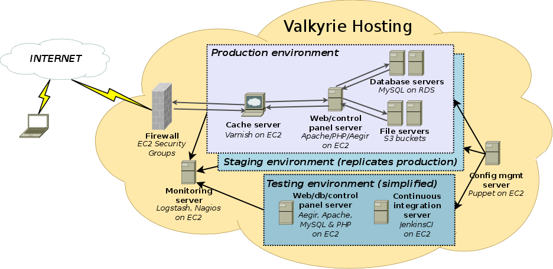

Diagrams
========

The diagrams below illustrate portions of the software stack, as well as both
basic and high-availability network topologies.

We use Dia_ to design these diagrams. The source files can be found in `diagrams/sources/`.

.. _Dia: https://wiki.gnome.org/Apps/Dia/

Software stack
--------------

This diagram illustrates the various components required by a Drupal-based web
application, and how Aegir manages them:

.. image:: diagrams/aegir_software_stack.png

.. todo:: Figure out how to add the Aegir logo directly to the .dia.

Vagrant Network (Basic)
------------------------

This diagram illustrates the network topology for a Valkyrie deployment in the
AWS cloud:

Vagrant Network (High availability)
-----------------------------------

This diagram illustrates the network topology for a high-availability, fully
scalable Valkyrie deployment in the AWS cloud:

.. image:: diagrams/valkyrie_network_ha.png

